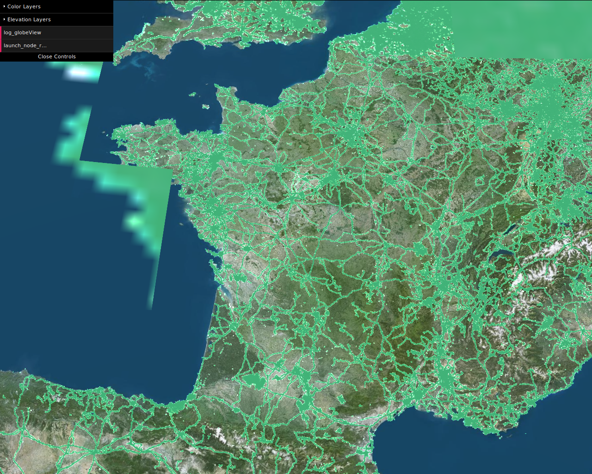
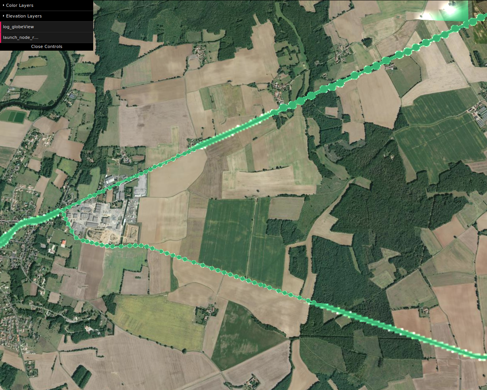
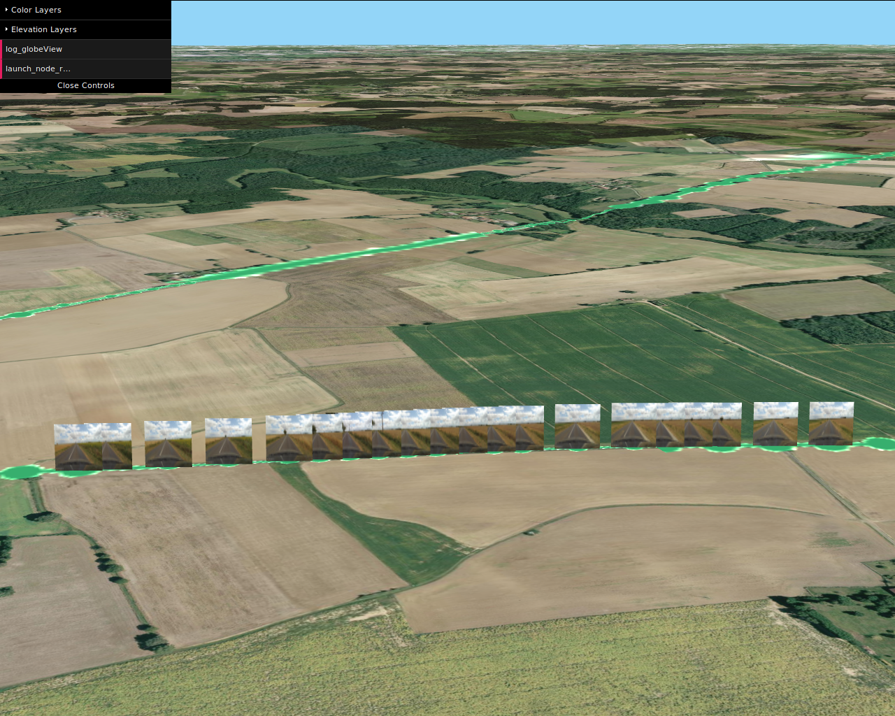
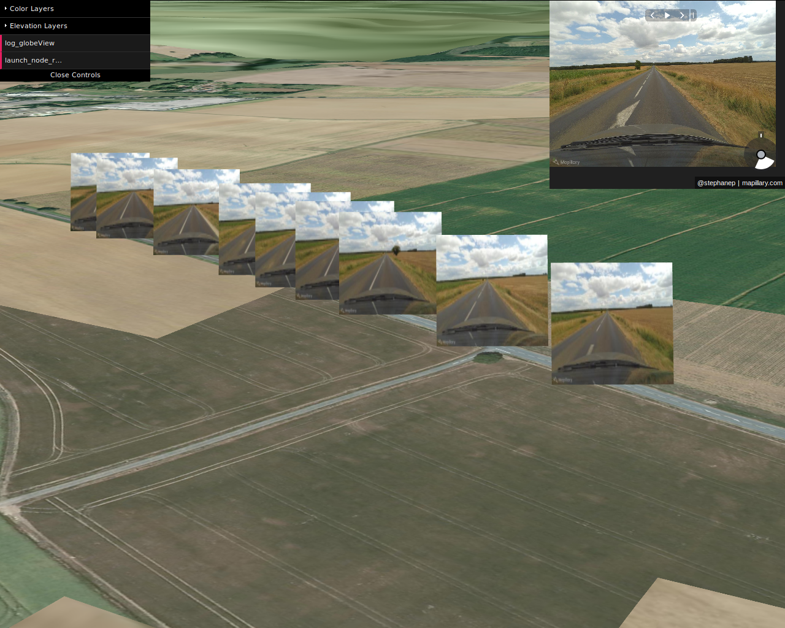

# Mapillary Raster Integration

## Just a few screenshots

### France GlobeView

Here we see the globeView.

There only a raster WFS stream from Mappilary ( all the greeen points).



### Zoom



Each little greeen points represents a pictures, taken by a mapillary user.

### Zoom even more



If the camera zoom is over 18, plan geometry with  pictures insides appears and face the user camera.

### zoom even closer

If we zoom even more, a mapillary viewer appears at top right.



# Readme rendu

Integration de mapillary dans iTowns.

Travail dans les fichiers mapillaryIntegration.html and mapillaryIntegration.js

Authors : azarz (Amaury Zarzelli), arnaudgregoire (Arnaud Gregoire), VictorLambert42 (Victor Lambert)

## Déroulement prévisionnel :

## Objectives

- Raster layer : Using mapillary layer for visualization.
- 3D objects vector layer : 3D objects, position and direction of photograph shooting. Pop-up generation with related images.
- mapillary-js viewer integration.
- (!OPTIONAL) Native iTowns instead of using mapilary-js viewer.

## Workflow

The projects tends to be realized through 3 principal points.

### Real-time positioning

The first data needed are the tiles which are in the field of view of the camera.
In fact, data from mapillary will be queried corresponding to the zoom level and the positions of the tiles.
At every movement of the camera, all the loaded deeper tiles in the field of view will be updated and if not already stored, a query will get the corresponding mapilary data.

### Querying

As soon as new tiles are loaded, queries has to be send in order to get vector datas from mapillary (photograph datas and link to resources).
This queries needs to be asynchronous in order to leave the user free to move.
When the queries are done, some 3D objects needs to be displayed on the map in order to inform the user of the presence of photographs.
Morever, those objects need to be clickable in order to display information about the photograph and the photograph itself in a pop-up.
For this purpose, some of iTowns functions are being studied to display those pop-up.

### 3D Viewer

After reviewing photograph data, the user needs to be able to enter the "viewer mode".
The viewer mode would first use mapillary-js viewer.
Then, the objective is to create a new WebGL scene, displaying the selected photograph in front of the camera.
Each of those photographs would need to be related to its nearest neighbor, in order to navigate between them in the viewer itself.


## Déroulement réel :

Nous avons effectivement effectué les requêtes mapillary par rapport aux tuiles iTowns.

Finalement, par manque de temps, plutôt que de créer un popup au clic sur des objets 3D, nous avons directement affiché les images à leur emplacement de prise de vue. Elle font toujours face à la caméra. Cela pourra être adapté en un affichage uniquement après un clic sur un objet 3D (sphère, par exemple) qui sera géré à l'aide d'un système de raycasting et d'écouteur d'évènements.

Le viewer Mapillary a été intégré dans un coin de la fenêtre pour ne pas altérer la navigation 3D dans iTowns.

### Fonctionnement final de l'application

Aux niveaux de zooms inférieurs à 17 (donc lorsque c'est dézoomé), les requêtes ne se font qu'à la couche raster Mapillary, qui affiche, en fonction de l'échelle, des surfaces, lignes ou points correspondant aux prises de vues.

Lorsque le niveau de zoom est supérieur ou égal à 17 (donc très zoomé, proche du globe), plutôt que d'afficher la couche raster, on affiche des mesh 3D de type plan, avec comme texture l'image Mapillary correspondante, ainsi que le viewer Mapillary dans le coin supérieur droit de l'image pour naviguer parmi les images. L'image de base de ce viewer est l'image le plus proche du centre de la vue iTowns.

Enfin, nous avons limité le nombre d'images apparaissant à l'écran au nombre de 300 pour éviter les problèmes de mémoire.
Cela pose des problèmes dans les zones à forte densité d'images car tout ne peut pas être affiché à la fois. 


## Comment faire marcher la démo en local ?

Cloner ou télécherger le projet.

Se placer à la racine avec l'invite de commande, puis lancer la commande
```sh
$ npm install
```
Si cette commande plante après l'erreur uglify js, il faut fermer le terminal, le réouvrir et relancer la commande npm install.

Une fois cela fait, lancer la commande
```sh
$ npm start
```
Par défaut, le serveur tournera sur localhos:8080.

Pour accéder à la démo, il faut donc se rendre à l'adresse localhost:8080/examples/mapillaryIntegration.html à partir d'un navigateur (navigateurs testés : Firefox et Chromium).

La vue initiale est placée près du château de Versailles, à un niveau de zoom supérieur à 17. On peut donc se déplacer dans le monde avec les contrôles iTowns classiques pour visiter les prises de vues.